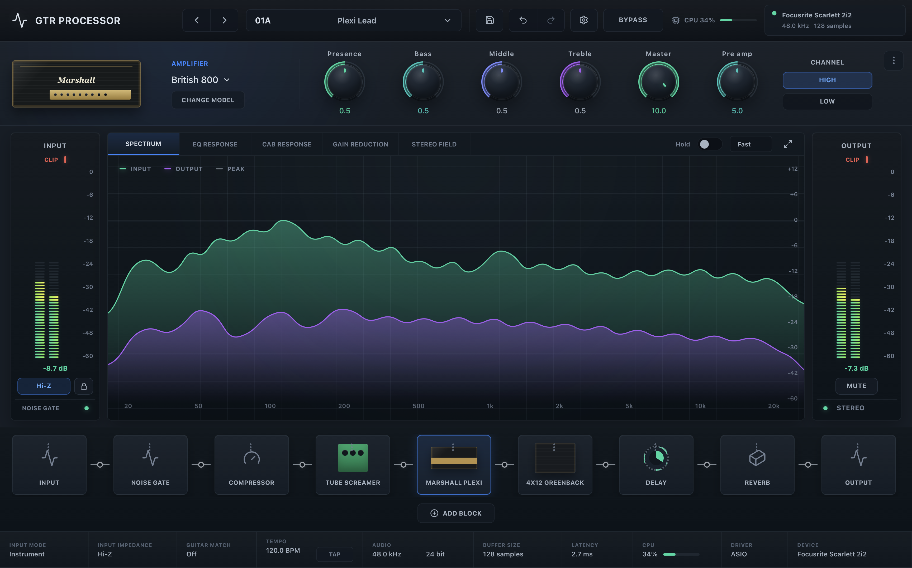

# GTR Processor

GTR Processor is a Rust-based guitar signal processing project. The repository is organized as a workspace so the DSP engine, audio I/O layer, and desktop application can evolve independently while sharing the same processing core.



## Project Layout

```text
.
├── crates/
│   ├── dsp-core/      # DSP primitives, amps, cabinets, filters, WDF experiments
│   └── audio-io/      # CPAL-based realtime input/output layer
└── apps/
    └── standalone/    # Tauri desktop application
```

## DSP Architecture

`crates/dsp-core` contains the audio processing domain logic. It is intended to stay independent from any specific host application, UI framework, or plugin format.

The main concepts are:

- `SampleProcessingNode`: processes one sample at a time. This is useful for gain stages, filters, amp stages, distortion, volume, and other sample-local processors.
- `BlockProcessingNode`: processes a mutable block of samples. This is used for processors that need a fixed block size, especially FFT-based cabinet convolution.
- `SignalChain`: runs a sequence of block processors in order.
- `SampleProcessingChain`: adapts sample processors into a block processor, so amp/pre-cab stages can be placed inside the same block-oriented signal chain.

Current DSP areas include:

- Amplifier modeling, currently centered around `British800Amp`.
- Input stages, gain stages, cold clipper behavior, tone stack experiments, and master volume smoothing.
- Filters and utility effects.
- Cabinet simulation through partitioned convolution.
- WDF experiments for analog-style circuit modeling.

The cabinet path currently uses a fixed-block partitioned convolution model:

```text
input block -> amp/pre-cab processing -> cabinet IR convolution -> output block
```

Because the cabinet convolution is FFT/overlap-add based, it expects a stable DSP block size. Device callback sizes should be normalized before reaching `dsp-core`.

## Audio I/O Architecture

`crates/audio-io` owns realtime device interaction through `cpal`.

Its responsibilities are:

- Select and configure input/output devices.
- Resolve a compatible sample rate and stream format.
- Convert device input into mono `f32` samples.
- Move samples between input and output callbacks through a ring buffer.
- Adapt host/device callback behavior to the fixed block size expected by DSP.

On macOS, callback sizes can vary between devices and even between consecutive callbacks. For example, one callback may request 1024 frames and the next may request 90. The audio layer should absorb that variability and feed `dsp-core` fixed-size blocks, rather than forcing every DSP node to handle arbitrary callback sizes.

The intended flow is:

```text
CPAL input callback
    -> mono f32 ring buffer
    -> fixed-size DSP block assembler
    -> SignalChain
    -> processed output queue
    -> CPAL output callback
```

## Standalone Application

`apps/standalone` is the desktop application target. It uses Tauri for the native shell and a frontend UI for controlling the current guitar processing chain.

The standalone app is responsible for:

- Starting and stopping audio.
- Managing the active amplifier model and its parameters.
- Exposing Tauri commands for UI controls such as knobs and amp input selection.
- Building the current `SignalChain` from shared `dsp-core` components.
- Providing a development surface for UX, metering, signal chain editing, and preset workflows.

The standalone app should remain a host around the reusable DSP and audio crates. DSP behavior should stay in `dsp-core`; device and stream logic should stay in `audio-io`.

## Future Plugin Implementation

The long-term direction is to reuse the same DSP engine in plugin formats such as VST3, AU, or CLAP.

The plugin implementation should be a separate host target, not a fork of the DSP code. It should depend on `dsp-core` directly and provide only the plugin-specific integration layer:

- Host parameter mapping.
- Plugin lifecycle and state serialization.
- Audio process callback adaptation.
- Preset loading/saving.
- UI embedding if supported by the plugin format.

The expected architecture is:

```text
Standalone app  ─┐
Plugin target   ├── dsp-core
Other hosts     ┘

Standalone app  -> audio-io -> system audio devices
Plugin target   -> plugin host audio callback
```

This keeps amplifier models, cabinet convolution, filters, and signal chain behavior consistent across standalone and plugin builds.

## Development

Common checks:

```bash
cargo check
cargo test
```

Standalone frontend checks:

```bash
cd apps/standalone
npm run check
```

Run the Tauri app from the standalone package when working on the desktop host.

